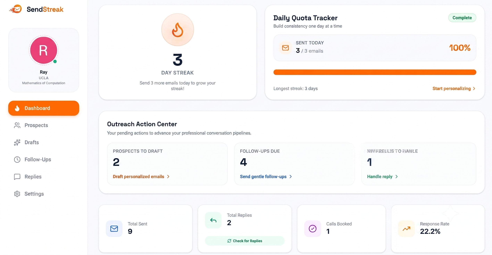

# SendStreak

SendStreak is an open-source, AI-powered, gamified cold outreach assistant designed to help students, researchers, and job seekers maintain daily cold emailing habits, personalize outreach using Gemini AI, track prospects, and boost response rates.



---

## Key Features

- **AI Draft Generator**: Powered by Gemini API (`@google/genai`) to draft highly personalized cold emails based on your background, recipient bio, and custom brag sheet.
- **Resume Context Integration**: Upload your resume PDF to extract skills, project experience, and background for hyper-tailored outreach.
- **Gmail OAuth Integration**: Connect your Gmail account to send emails directly from SendStreak and automatically check for replies.
- **Streak & Gamification Engine**: Build daily cold emailing habits with quota tracking, 1-day grace window streak restoration, and unlockable achievement badges.
- **Prospect CRM**: Manage outreach pipeline with statuses (`Drafting`, `Sent`, `Followed Up`, `Replied`), notes, search, filtering, and CSV batch import/export.
- **Self-Hostable & 100% Free**: Fully open source with no paywalls, feature gates, or artificial limits.

---

## Tech Stack

- **Frontend**: React 19, TypeScript, Tailwind CSS, Lucide Icons, Motion
- **Backend Server**: Express.js with Vite development server middleware
- **AI**: Google Gemini API (`@google/genai`)
- **Database & Auth**: Firebase Auth (Google Sign-In) & Cloud Firestore
- **Build System**: Vite & Esbuild (`dist/server.cjs`)

---

## Step-by-Step Setup Guide

### 1. Prerequisites

Before running SendStreak, ensure you have:
- **Node.js**: v18.0.0 or higher (`node -v`)
- **npm**: v9.0.0 or higher (`npm -v`)
- A **Google Cloud Account** (for Gemini API & Gmail OAuth)
- A **Firebase Account** (for Authentication & Cloud Firestore)

---

### 2. Procure Gemini API Key

1. Go to [Google AI Studio](https://aistudio.google.com/).
2. Sign in with your Google account.
3. Click **Get API Key** -> **Create API Key**.
4. Copy the generated key. You will save this as `GEMINI_API_KEY` in your `.env` file.

---

### 3. Setup Firebase Project (Database & Authentication)

1. Open the [Firebase Console](https://console.firebase.google.com/) and click **Add Project**.
2. Name your project (e.g., `sendstreak-app`) and follow the steps to complete setup.

#### Enable Firebase Authentication
1. Navigation menu -> **Build** -> **Authentication** -> **Get Started**.
2. Under **Sign-in method**, choose **Google**.
3. Enable the Google provider, configure your project support email, and click **Save**.

#### Provision Cloud Firestore
1. Navigation menu -> **Build** -> **Firestore Database** -> **Create Database**.
2. Select your preferred database region and start in **Production Mode**.
3. Go to the **Rules** tab in Firestore and paste the security rules provided in `firestore.rules`:
   ```javascript
   rules_version = '2';
   service cloud.firestore {
     match /databases/{database}/documents {
       match /users/{userId} {
         allow read, write: if request.auth != null && request.auth.uid == userId;
         
         match /{subcollection=**} {
           allow read, write: if request.auth != null && request.auth.uid == userId;
         }
       }
       match /global_stats/{statId} {
         allow read: if true;
         allow write: if request.auth != null;
       }
     }
   }
   ```
4. Click **Publish**.

#### Get Web App Credentials
1. Click the gear icon next to **Project Overview** -> **Project settings**.
2. Under **General** -> **Your apps**, click the **Web icon** to register a web app.
3. Enter an App nickname (e.g., `SendStreak Web`) and click **Register app**.
4. Copy the `firebaseConfig` object properties:
   - `apiKey` -> `VITE_FIREBASE_API_KEY`
   - `authDomain` -> `VITE_FIREBASE_AUTH_DOMAIN`
   - `projectId` -> `VITE_FIREBASE_PROJECT_ID`
   - `storageBucket` -> `VITE_FIREBASE_STORAGE_BUCKET`
   - `messagingSenderId` -> `VITE_FIREBASE_MESSAGING_SENDER_ID`
   - `appId` -> `VITE_FIREBASE_APP_ID`

---

### 4. Enable Gmail API & Configure OAuth 2.0

To allow users to send emails directly from Gmail and check for replies:

1. Go to the [Google Cloud Console](https://console.cloud.google.com/) and select the project corresponding to your Firebase project.
2. In the search bar, search for **Gmail API** and click **Enable**.
3. Go to **APIs & Services** -> **OAuth consent screen**:
   - Choose **External** user type and click **Create**.
   - Fill in App Information (App name: `SendStreak`, User support email, Developer contact email).
   - Click **Save and Continue**.
4. Under **Scopes**, click **Add or Remove Scopes** and add:
   - `https://www.googleapis.com/auth/gmail.send`
   - `https://www.googleapis.com/auth/gmail.readonly`
   - `https://www.googleapis.com/auth/userinfo.email`
   - `https://www.googleapis.com/auth/userinfo.profile`
5. Under **Test Users**, add your email address (and any other emails testing the app). Save changes.
6. Go to **APIs & Services** -> **Credentials** -> **Create Credentials** -> **OAuth client ID**:
   - Application type: **Web application**
   - Name: `SendStreak Web Client`
   - **Authorized JavaScript origins**: `http://localhost:3000` (and your production domain)
   - **Authorized redirect URIs**: `http://localhost:3000` (and your production domain)
   - Click **Create**.

---

### 5. Local Setup & Environment Variables

1. Clone the repository:
   ```bash
   git clone https://github.com/sankhyanreyansh/SendStreak.git
   cd SendStreak
   ```

2. Copy `.env.example` to `.env`:
   ```bash
   cp .env.example .env
   ```

3. Open `.env` in your code editor and populate all required variables:
   ```env
   # Gemini API Key
   GEMINI_API_KEY=AIzaSyYourGeminiApiKeyHere

   # App Base URL
   VITE_APP_URL=http://localhost:3000

   # Firebase Configuration
   VITE_FIREBASE_API_KEY=AIzaSyYourFirebaseApiKeyHere
   VITE_FIREBASE_AUTH_DOMAIN=your-app.firebaseapp.com
   VITE_FIREBASE_PROJECT_ID=your-project-id
   VITE_FIREBASE_STORAGE_BUCKET=your-project.appspot.com
   VITE_FIREBASE_MESSAGING_SENDER_ID=123456789012
   VITE_FIREBASE_APP_ID=1:123456789012:web:abcdef123456
   VITE_FIREBASE_FIRESTORE_DB_ID=(default)
   ```

4. Install dependencies:
   ```bash
   npm install
   ```

5. Start the development server:
   ```bash
   npm run dev
   ```

6. Open your browser and navigate to **[http://localhost:3000](http://localhost:3000)**.

---

## Production Deployment

To build and run the application for production:

```bash
# Compile client assets and bundle backend server
npm run build

# Start production Node.js server
npm start
```

The app will start on port `3000` by default.

---

## License

Distributed under the [MIT License](LICENSE). Free to modify, self-host, and distribute.

